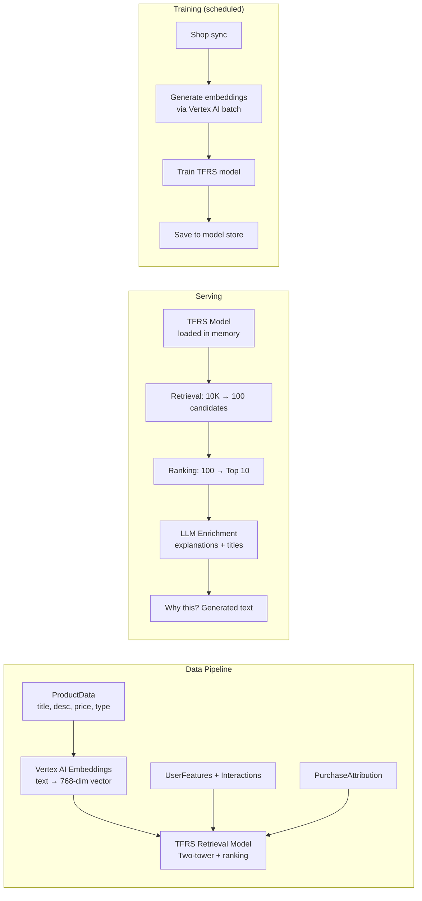

# TFRS + Vertex AI Migration Plan

## Overview

Replace Gorse (collaborative filtering only) with TFRS two-tower model + Vertex AI embeddings.
Keeps same API interface so Mercury, Apollo, Venus continue working unchanged.

## Architecture



## Files to Create

| #   | File                                                     | Purpose                                | Status     |
| --- | -------------------------------------------------------- | -------------------------------------- | ---------- |
| 1   | `python-worker/app/recommandations/tfrs/__init__.py`     | Package init                           | ✅ Created |
| 2   | `python-worker/app/recommandations/tfrs/config.py`       | Model hyperparameters                  | ✅ Created |
| 3   | `python-worker/app/recommandations/tfrs/features.py`     | Feature transformers (Vertex AI embed) | ⏳         |
| 4   | `python-worker/app/recommandations/tfrs/model.py`        | Two-tower + ranking model              | ⏳         |
| 5   | `python-worker/app/recommandations/tfrs/trainer.py`      | Training pipeline                      | ⏳         |
| 6   | `python-worker/app/recommandations/tfrs/serving.py`      | Inference wrapper                      | ⏳         |
| 7   | `python-worker/app/recommandations/tfrs/scheduler.py`    | Scheduled training trigger             | ⏳         |
| 8   | `python-worker/app/recommandations/tfrs/llm_enricher.py` | Vertex AI: explanations + titles       | ⏳         |
| 9   | `python-worker/app/recommandations/tfrs/embeddings.py`   | Vertex AI: product embeddings          | ⏳         |

## Vertex AI Integration

### 1. Product Embeddings (Vertex AI text-embedding)

```python
from vertexai.language_models import TextEmbeddingModel

model = TextEmbeddingModel.from_pretrained("text-embedding-004")

async def generate_product_embeddings(shop_id: str, products: List[ProductData]):
    """Generate semantic embeddings for all products in a shop."""
    texts = [
        f"{p.title}. {p.description[:500]}. "
        f"Type: {p.product_type}. Price: ${p.price}. "
        f"Vendor: {p.vendor}. Tags: {', '.join(p.tags)}"
        for p in products
    ]

    # Vertex AI batch embedding (free tier: 1000 requests/min)
    embeddings = model.get_embeddings(texts)

    # Store in product_embeddings table for TFRS training
    for product, emb in zip(products, embeddings):
        await store_embedding(shop_id, product.product_id, emb.values)
```

**Cost**: Vertex AI text-embedding-004: ~$0.0001 per 1K characters.
For 10K products with 500 chars each = ~$0.50 per full sync. Negligible.

### 2. Recommendation Explanations (Vertex AI Gemini)

```python
from vertexai.generative_models import GenerativeModel

gemini = GenerativeModel("gemini-2.0-flash-001")

async def explain_recommendation(user_context, recommended_products):
    prompt = f"""
    Customer purchased: {user_context['recent_purchases']}
    Customer's cart: {user_context['cart_items']}
    Recommended products: {recommended_products}

    Generate a short, natural explanation for each recommendation.
    Return as JSON array with fields: product_id, explanation, section_title
    """
    response = gemini.generate_content(prompt)
    return parse_json(response.text)
```

**Cost**: Gemini Flash: ~$0.0002 per request. At 10K rec requests/month = $2.

### 3. Vertex AI Configuration

Add to `.env.prod.example`:

```env
# Vertex AI (Google Cloud) — product embeddings + LLM enrichment
VERTEX_AI_PROJECT_ID=better-bundle-prod
VERTEX_AI_LOCATION=us-central1
VERTEX_AI_EMBEDDING_MODEL=text-embedding-004
VERTEX_AI_GENERATIVE_MODEL=gemini-2.0-flash-001
GOOGLE_APPLICATION_CREDENTIALS=/secrets/vertex-ai-key.json
```

## Step-by-Step Implementation

### Phase 1: TFRS Engine (Week 1)

1. Feature transformers with Vertex AI embeddings
2. Two-tower model definition
3. Training pipeline
4. Serving wrapper
5. Wire into recommendation executor

### Phase 2: LLM Layer (Week 2, in parallel)

6. Vertex AI product embedding generation (batch job)
7. LLM enrichment for explanations + titles
8. Merchant-facing "Why this?" in API response

### Phase 3: Cleanup (Week 2 end)

9. Delete Gorse files
10. Update docker-compose
11. Update env files

## Timeline

| Step                    | Effort   | Vertex AI Cost   |
| ----------------------- | -------- | ---------------- |
| 1. Feature transformers | 1 day    | Free (dev tier)  |
| 2. TFRS model           | 1.5 days | Free             |
| 3. Training pipeline    | 1.5 days | Free             |
| 4. Serving wrapper      | 1 day    | Free             |
| 5. Wire into executor   | 0.5 day  | Free             |
| 6. Product embeddings   | 1 day    | ~$0.50/full sync |
| 7. LLM enrichment       | 1 day    | ~$2/10K requests |
| 8. Cleanup Gorse        | 0.5 day  | Free             |

**Total active: ~8 days** | **Vertex AI cost: ~$3-10/month**
